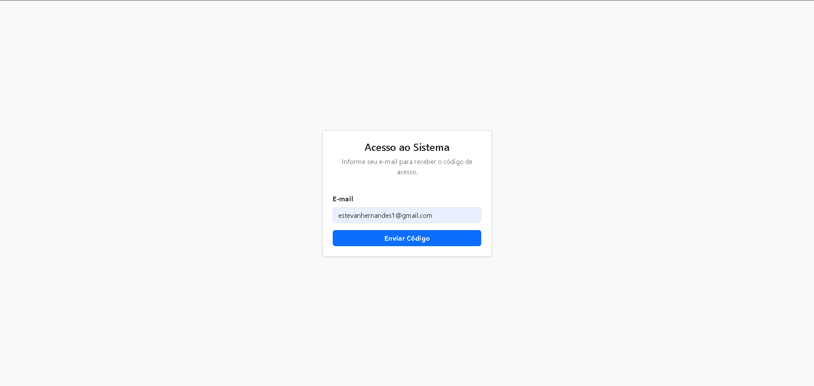
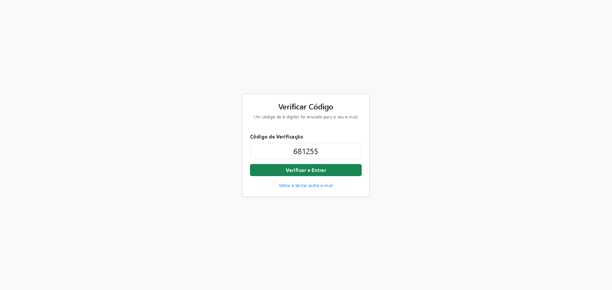
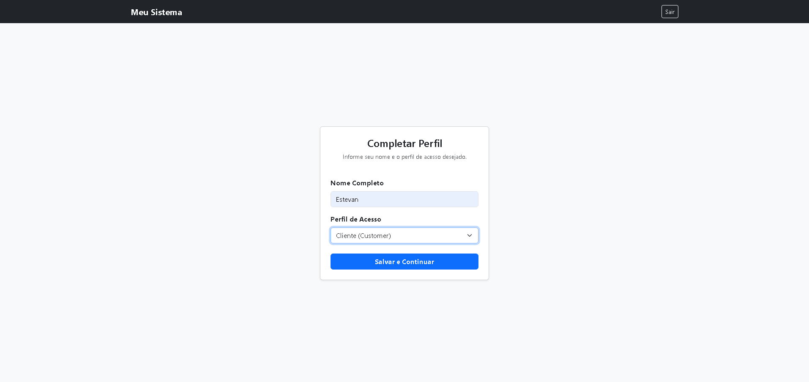
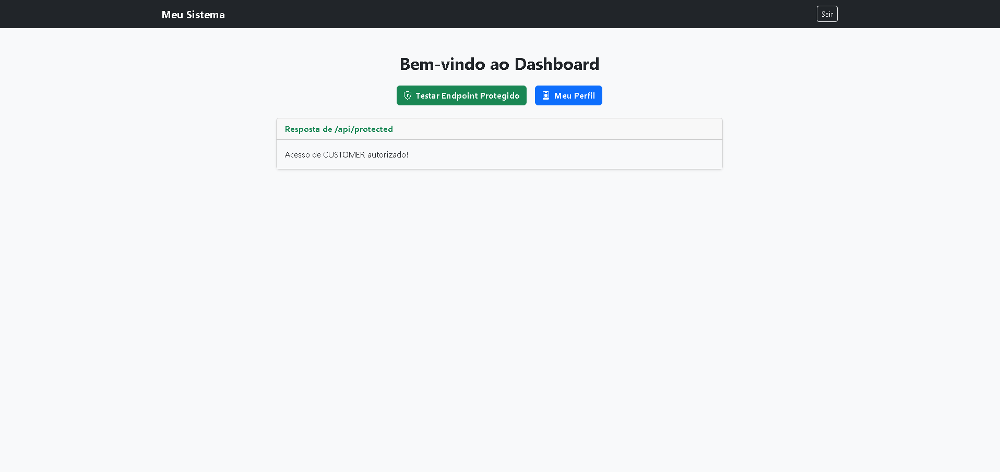
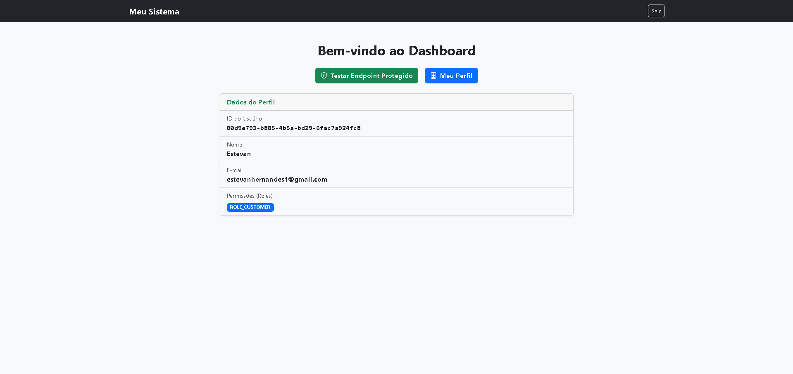

# Sistema de Autenticação - Arquitetura de Microsserviços

Este projeto implementa um fluxo de autenticação e gestão de usuários utilizando uma arquitetura distribuída baseada em microsserviços.

## 🏗️ Descrição da Arquitetura

O sistema é composto por três aplicações principais que se comunicam de forma síncrona e assíncrona:

1. **Frontend (Node.js):** Interface com o usuário que atua de forma independente, enviando as requisições HTTP diretamente para o serviço de gestão de usuários.
2. **MS_Users (Spring Boot):** Microsserviço central que recebe as requisições do frontend, gerencia o banco de dados de usuários/perfis e, quando necessário (ex: envio de código de acesso), publica uma mensagem em uma fila do RabbitMQ.
3. **MS_Email (Spring Boot):** Microsserviço responsável exclusivamente pela notificação. Ele atua como um _worker_, consumindo as mensagens da fila do RabbitMQ e realizando o disparo dos e-mails via SMTP para os usuários finais.

## 📋 Pré-requisitos

Para executar este projeto localmente, certifique-se de ter as seguintes ferramentas instaladas:

- **Java Development Kit (JDK):** Versão 21 ou superior.
- **Node.js:** Versão 22 ou superior.
- **MySQL:** Servidor de banco de dados rodando localmente (geralmente na porta 3306).
- **RabbitMQ:** Instância local ou em nuvem (ex: CloudAMQP) para a mensageria.
- **Servidor de E-mail:** Conta configurada para envio SMTP (ex: Gmail com "Senha de App").

## ⚙️ Instruções de Configuração

### 1. Bancos de Dados (MySQL)

Você precisará criar dois bancos de dados independentes no seu servidor MySQL para garantir o isolamento dos dados de cada microsserviço:

```sql
CREATE DATABASE ms_user;
CREATE DATABASE ms_email;
```

### 2. Variáveis de Ambiente (Frontend)

O frontend precisa saber para onde enviar as requisições da API. Siga os passos abaixo:

1. Acesse a pasta do projeto Node.js (`frontend`).
2. Localize o arquivo de exemplo chamado `.env.local`.
3. Duplique este arquivo e renomeie a cópia para `.env` (removendo a extensão final).
4. Abra o `.env` e preencha as variáveis com a porta onde o seu `MS_Users` está rodando.

### 3. Propriedades dos Microsserviços (Spring Boot)

Para que os microsserviços em Java funcionem corretamente, você deve configurar os arquivos `src/main/resources/application.properties` em ambos os projetos com as suas credenciais locais:

**No MS_Users:**

- Preencha as credenciais e a URL de conexão com o banco `ms_user`.
- Preencha as credenciais e a URL de conexão com a sua instância do RabbitMQ.

**No MS_Email:**

- Preencha as credenciais e a URL de conexão com o banco `ms_email`.
- Preencha as credenciais e a URL de conexão com a sua instância do RabbitMQ.
- Preencha os dados do servidor SMTP (seu e-mail remetente e senha gerada).

## 🚀 Passos para Executar

Para que a aplicação funcione em sua totalidade, é necessário iniciar as três aplicações em terminais separados.

### 1. Iniciar o MS_Users

Abra um terminal na pasta do MS_Users e execute:

```bash
cd caminho/para/ms_user
mvn spring-boot:run
```

### 2. Iniciar o MS_Email

Abra um terminal na pasta do MS_Email e execute:

```bash
cd caminho/para/ms_email
mvn spring-boot:run
```

### 3. Iniciar o Frontend (Node.js)

Abra um terminal na pasta do frontend (client), instale as bibliotecas e inicie a aplicação:

```bash
cd caminho/para/client
npm install
npm start # ou node server.js
```

## 📸 Capturas de Tela do Sistema

Abaixo estão as imagens demonstrando o fluxo completo de funcionamento da aplicação:

**1. Tela de Solicitação de Código (Frontend)**


**2. E-mail Recebido com o Código (MS_Email)**


**3. Tela de Validação do Código**


**4. Tela para Completar Perfil**


**5. Retorno do Endpoint Protegido**


**6. Retorno do Endpoint de Perfil (/me)**

